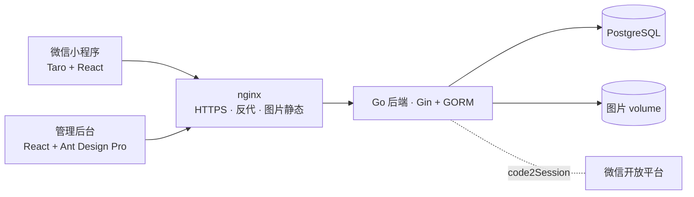

# shop-mall · 电商小程序

微信小程序（Taro + React）+ 管理后台（React + Ant Design Pro）+ Go 后端（Gin + GORM）+ PostgreSQL，积分支付，单机 Docker Compose 部署。一个模块化单体，靠接口分组和权限码隔离买家端与管理端。

## 架构



## 技术栈

- 后端：Go + Gin + GORM，迁移用 goose，跨模块事务在 `internal/application` usecase 里编排
- 小程序：Taro + React + Zustand
- 管理后台：React + Ant Design Pro
- 数据库：PostgreSQL，各环境用同一个镜像
- 支付：积分代替真实支付，接口按真实支付结构预留
- 部署：单台 2C4G + Docker Compose

## 启动

```bash
make test            # 跑全部测试（后端 + 前端）
make build           # 构建后端和前端
make compose-up      # 本地起整套服务
make contract-check  # 校验 OpenAPI 契约
```

本地验证基线：Go 1.26.x、Node 24.x、pnpm 10.x、Docker Compose 5.x。

## 项目知识库地图

| 内容 | 位置 |
|---|---|
| 全景图文（三端截图导览） | `docs/图文-shop-mall-全景介绍.md` |
| PRD | `docs/prd.md` |
| 架构与 specs | `docs/architecture/`、`docs/api/openapi.yaml` |
| 决策记录 | `docs/decisions/decision-log.md` |
| 复盘 | `docs/postmortems/` |
| 发布与恢复 | `docs/ops/release-recovery.md` |
