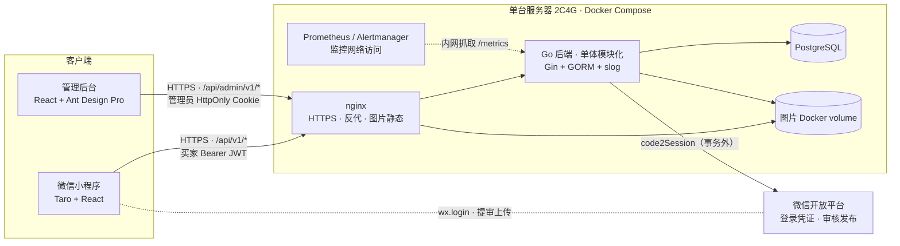
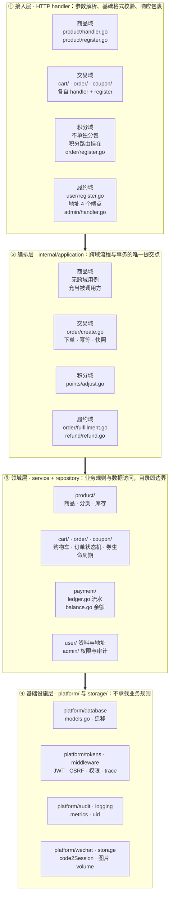
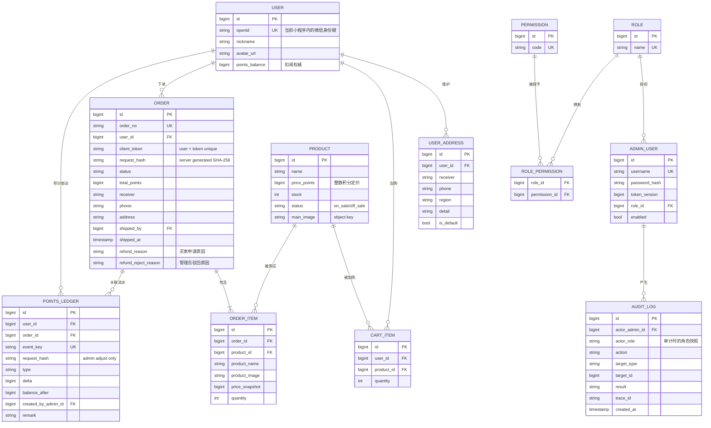
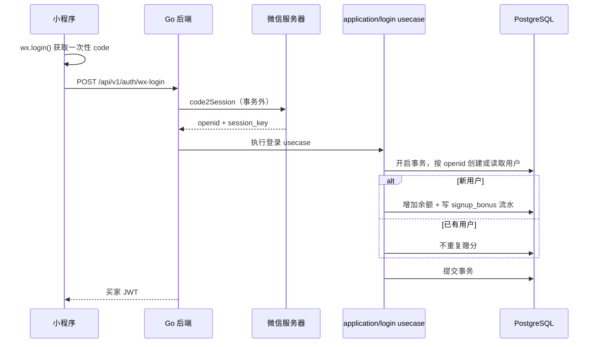
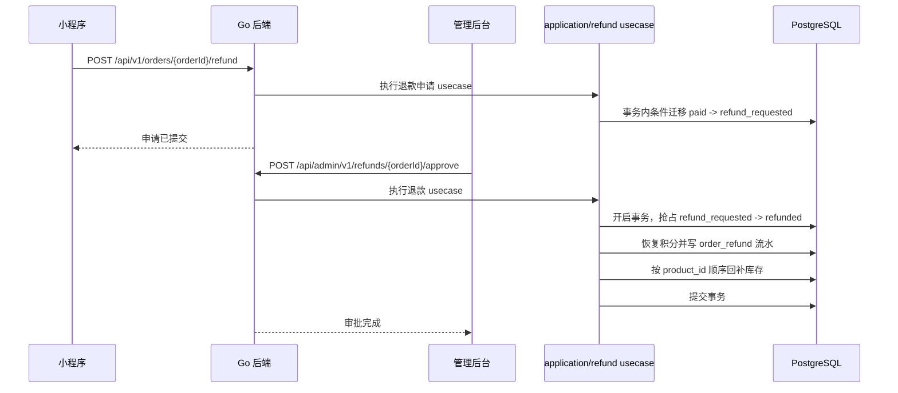
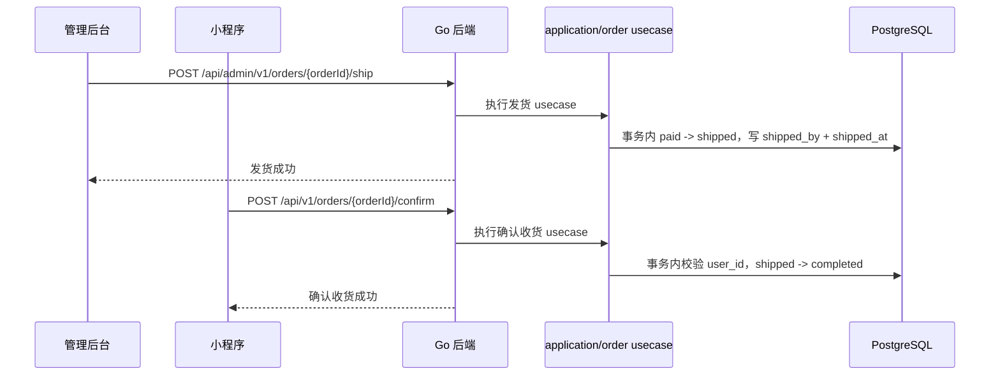
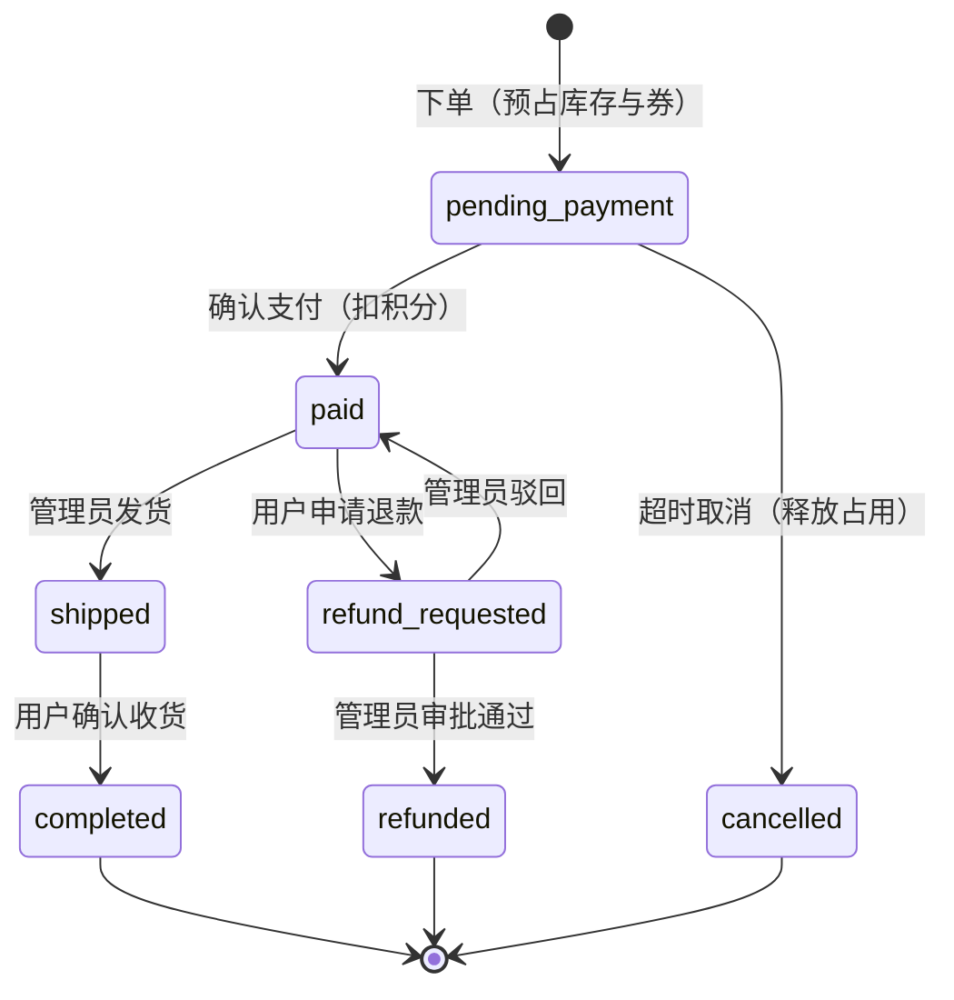

# 电商小程序 · 架构总览

本文档是整个项目的架构入口。业务域划分、分层与数据归属见第 2 节；接口字段、错误码和鉴权细节以 `../api/openapi.yaml` 为唯一契约源；端内实现看 01~04，数据库落库细节看 `05-database.md`。

> 当前目标状态：优惠券、待支付订单、确认支付、超时取消及七状态订单机以 `07-coupon-pay-lifecycle.md` 为准；本文旧版下单即支付流程已由该 feature techspec 覆盖。

## 1. 系统拓扑



- 单体单服务。课程体量上微服务只有成本没有收益；模块边界切清楚，以后要拆才拆得动。
- 管理后台和小程序复用同一个后端服务，靠接口分组、独立鉴权和权限码隔离。
- `/health/live` 只判断进程存活，`/health/ready` 检查数据库等关键依赖；两个探活接口不使用业务 JWT，但只允许探活网络访问。
- 图片文件存储在独立 Docker volume，数据库只保存稳定 object key，不保存完整域名。

## 2. 业务域划分与分层

0 到 1 阶段，架构设计只回答一个问题：**边界划在哪**。本文用两个方向回答它——纵向按业务能力切成四个域，横向按技术职责切成四层；两个方向的交叉就是一个包，包名即边界。



### 2.1 四个域各自管什么

| 域 | 职责 | 归属包 | 关键表 / 列 |
|---|---|---|---|
| **商品域** | 商品、分类、上下架、库存底表 | `product/` | `products`（含 `category`、`stock`） |
| **交易域** | 购物车、下单结算、订单状态机、交易快照、券生命周期 | `cart/`、`order/`、`coupon/` | `cart_items`、`orders`、`order_items`、`coupon_templates`、`user_coupons` |
| **积分域** | 积分余额与流水，替代真实资金的收银台 | `payment/` | `users.points_balance`、`points_ledger` |
| **履约域** | 收货地址、发货、退款；运营后台的权限与审计机制 | `user/`、`admin/`、`application/refund` | `user_addresses`、`admin_users`、`roles`、`permissions`、`role_permissions`、`audit_logs` |

管理后台不是第五个域。`admin/` 提供权限闸门与审计机制，横向覆盖四个域的运营动作：商品上下架归商品域，积分调整归积分域，券模板归交易域，发货与退款归履约域。

### 2.2 数据归属定边界

一条规则：**一张表只有一个域写，其他域要用，走对方暴露的入口。**

| 表 | 唯一写入方 | 其他域如何取用 |
|---|---|---|
| `products` | 商品域 | 购物车经 `product.Service` 读价与库存（`cart/service.go`） |
| `cart_items` | 交易域 | 下单用例同事务内删除已结算行 |
| `orders` / `order_items` | 交易域 | 履约域的发货、确认收货经 `order.Repository` 写，不另开表 |
| `coupon_templates` / `user_coupons` | 交易域 | 后台模板管理走交易域用例 |
| `users.points_balance` / `points_ledger` | 积分域 | 由 `application/order/create.go` 与 `application/refund` 在事务内调用 |
| `user_addresses` | 履约域 | 下单用例经 `user.AddressService` 读地址并落快照 |
| `admin_users` / `roles` / `permissions` / `role_permissions` | 履约域（后台机制） | 各域只经权限闸门判断，不直改权限表 |
| `audit_logs` | 共享机制 | 写入器在 `platform/audit`，各域在写操作路径上调用（后台写操作、发货、退款、积分调整、券模板、商品上下架） |

`users` 一表两写主：资料列（昵称、头像）归履约域的买家资料，`points_balance` 归积分域。按列划归属比按表划更细一层。

### 2.3 三条拆分原则

1. **按业务能力拆，不按技术层拆。** 商城天然有几块业务，就按业务拆。若按技术层拆——所有查询一层、所有写库一层——改一个「下单」需求要横穿所有层，每层的边界都会被顺手糊掉。
2. **数据归属定边界。** 见 2.2。拆完之后，只要有一张表说不清归谁写，就是没拆对。
3. **不预先建路，但别把路堵死。** 0 到 1 不为想象中的流量提前付架构税；但今天的结构要保证明天流量真来了能拆得出去——`internal/` 已按域分包，按域抽服务是平移，不是重写。

### 2.4 边界怎么验：拿下单链路走一遍

纸面的拆分不算拆对。拿跨域点最多的一条链路真走一遍——一笔下单要穿过全部四个域：

买家提交 → 读商品域当前定价与库存（`product.Repository`）→ 交易域建单，把价格与收货地址以**快照**写进订单 → 积分域扣减余额、写 `order_pay` 流水 → 订单落 `paid`，履约域按该状态取到待发货单。

当前实现里，建单、扣库存、扣积分、写流水、删购物车行处在**同一个数据库事务**（`internal/application/order/create.go`），履约域取待发货单是**同库查询**，没有消息队列。每个跨域点都标得出同步还是异步、每一步的数据归谁写都说得清，才算拆对；哪个点标不出来，就是边界还没划清，回去重拆，不要带着含糊开工。

时序细节见第 6 节，状态机见第 7 节。这张图不是汇报材料：后面写代码、审代码，都拿它当对照——出现图上没有的跨域调用，就是跑偏。

### 2.5 当前实现与目标状态的差异

上面两张表描述的是**当前代码**。`07-coupon-pay-lifecycle.md` 定的目标状态尚未落进 migration，读文档时不要混起来：

- 当前 `application/order/create.go` 是**下单即成交**：建单、扣库存、扣积分、写流水、删购物车行在一个事务里完成，订单直接落 `paid`；订单状态枚举为 5 态（`paid`、`shipped`、`completed`、`refund_requested`、`refunded`）。
- 目标状态是**下单进 `pending_payment`**：预占库存（`products.hold_stock`）与券，支付成功才扣积分，超时由后台任务取消并释放占用；订单状态枚举扩到 7 态。
- 落地方式：加一条 forward migration（`products.hold_stock`、`orders.pay_expire_at`、状态枚举扩容与状态-时间戳 CHECK），`create.go` 拆成「下单预占」与「确认支付」两个用例。

四个域的归属不因这次变更改变，变的只是交易域内部的流程与状态枚举。

### 2.6 已知的边界例外

约定是「模块之间禁止跨模块直调对方 repository，跨模块流程由 `application` 编排」。现状有一处例外，记在这里，免得后来者以为规矩已经不成立：

- `/api/v1/points/ledger` 与 `/api/admin/v1/points/ledger` 由交易域 `OrderService` 直接持有 `payment.Repository` 提供，只读（`order/service.go`）。原因是积分域目前只暴露 `Repository` 与投影类型，没有 `Service` 层。修法是给积分域补一个只读 service，或把这两个端点移进积分域。

其余跨域引用不算例外：`order/model.go` 引用 cart、product、user 是复用错误哨兵与视图类型；`product/handler.go`、`coupon/handler.go` 引用 admin 是取权限码常量；各域引用 `storage` 属基础设施，不是业务域。

## 3. 技术选型与关键决策

| 决策 | 选择 | 理由 |
|---|---|---|
| 后端栈 | Go + Gin + GORM，迁移用 goose | 编译成单二进制，镜像小，生态成熟 |
| 事务编排 | `internal/application` usecase | 跨模块事务只有一个提交点，避免部分提交 |
| 后端日志 | slog | 标准库结构化日志，统一 trace_id |
| 后端监控 | prometheus/client_golang | 暴露 `/metrics`，由监控网络抓取 |
| 小程序端 | Taro + React | 与管理后台复用 React 经验 |
| 小程序状态 | Zustand | 只管理轻量客户端状态 |
| 管理后台 | React + Ant Design Pro | 列表、表单、权限组件成熟 |
| 数据库 | PostgreSQL，唯一数据库 | 各环境使用同一 Docker 镜像，减少差异 |
| 支付 | 积分代替真实支付 | 当前不接真实支付，但保留替换边界 |
| 图片存储 | 本地 volume + storage adapter | 当前简单可控，后续可替换对象存储 |
| 部署 | 单台 2C4G + Docker Compose | 详见第 9 节 |

## 4. 端间契约

完整接口、请求响应字段、security scheme 和权限扩展维护在 `docs/api/openapi.yaml`。

### 4.1 统一响应

```json
{
  "code": 0,
  "data": {},
  "message": "ok",
  "trace_id": "01J..."
}
```

- `code=0` 表示成功，非 0 为稳定业务错误码。
- `trace_id` 同时通过响应体和 `X-Trace-Id` 响应头返回。
- 内部异常不把 SQL、堆栈、微信密钥和敏感个人信息返回客户端。
- HTTP 状态码表达认证、权限、资源和冲突语义，具体映射以 OpenAPI 为准。
- 业务 API 使用统一响应包裹；`/health/live`、`/health/ready` 和 `/metrics` 是运维接口例外，响应格式由 OpenAPI 单独定义，并通过网络访问控制保护。

### 4.2 鉴权矩阵

| 范围 | 路径 | 鉴权 |
|---|---|---|
| 买家登录 | `POST /api/v1/auth/wx-login` | 公开 |
| 商品浏览 | `GET /api/v1/products`、`GET /api/v1/products/{id}` | 公开 |
| 买家业务 | `/api/v1/me`、`/cart`、`/addresses`、`/orders`、`/points` | 买家 Bearer JWT |
| 管理员登录 | `POST /api/admin/v1/auth/login` | 公开 |
| 管理员业务 | 其他 `/api/admin/v1/*` | 管理员 Cookie JWT + 权限码 |
| 探活监控 | `/health/*`、`/metrics` | 网络访问控制，不使用业务 JWT |
| 静态图片 | `/static/images/*` | 公开只读 |

- 未列入公开清单的接口默认拒绝访问。
- 买家 JWT 只代表身份，不代表资源归属；订单、地址、购物车和流水必须在 service 层追加 `user_id` 条件。
- 买家访问其他用户资源返回 404，避免泄露资源是否存在；管理员权限不足返回 403。
- 管理员 Cookie 使用 HttpOnly、Secure、SameSite；写请求必须通过 CSRF 校验。

### 4.3 错误码和通用约定

| 段 | 范围 | 示例 |
|---|---|---|
| 通用 | 1000-1999 | 参数、认证、权限、资源不存在 |
| 认证 | 2000-2999 | code2Session 失败、登录态过期 |
| 商品 | 3000-3999 | 商品下架、库存不足 |
| 订单 | 4000-4999 | 幂等冲突、状态迁移非法 |
| 积分 | 5000-5999 | 余额不足 |

- 分页：`page` 从 1 起，通用接口 `page_size` 默认 20、上限 100；公开商品、分类与搜索列表默认 10；响应包含 `list`、`total`、`page`、`page_size`。
- 时间：ISO 8601 UTC，Go 使用 RFC3339。
- 商品列表按 `id DESC` 排序，配合 `(status, id)` 索引。
- 积分、价格、库存和数量全部使用整数。
- 下单使用 `Idempotency-Key` header；成功重放返回原订单和 HTTP 200，参数变化返回 HTTP 409。

## 5. 数据模型

总览级 ER 只定实体、关键字段和关系，建表细节以 `05-database.md` 为准。 优惠券实体与订单支付新增字段见 `07-coupon-pay-lifecycle.md`，不在此图重复展开。



- `users.points_balance` 管实时扣减，`points_ledger` 管审计；余额和流水同一事务双写。
- 订单保存商品价格、商品信息和收货地址快照，商品改价、改图和地址修改不影响历史订单。
- `client_token` 与 `request_hash` 只记录成功订单；失败事务整体回滚。
- `event_key` 和业务级唯一索引防止重复账务事件。

## 6. 关键时序

### 6.1 登录与首次赠分



`session_key` 不落库、不下发、不写日志。事务提交失败时不签发 JWT；客户端重新调用 `wx.login()` 获取新 code。

### 6.2 下单、支付与超时取消

当前目标流程见 [`07-coupon-pay-lifecycle.md`](07-coupon-pay-lifecycle.md)，这里只保留总览：

- 买家在结算时可选一张 `available` 券；服务端按当前商品价格和券规则计算金额。
- 下单成功生成 `pending_payment` 订单，预占可售库存与优惠券，积分余额不变。
- 买家确认支付后，订单转为 `paid`，扣减积分、写 `order_pay` 流水、消耗预占库存并把券置为 `used`。
- 超过支付截止时间仍未支付的订单转为 `cancelled`，释放库存预占；优惠券按有效期回到 `available` 或置为 `expired`。
- 支付与超时取消竞速时，只有一个结果生效，另一方不产生副作用。

### 6.3 退款



审批驳回只做 `refund_requested -> paid`，不改余额、不写退款流水、不回补库存。并发审批中只有成功抢占状态的请求可以执行副作用。

### 6.4 发货和确认收货



两个操作都使用条件状态更新，重复请求不重复写入时间或操作人。

## 7. 订单状态机



- 状态迁移必须由服务端按允许路径校验，并在更新时带原状态条件。
- 退款只允许从 `refund_requested` 审批；发货只允许从 `paid` 迁移。
- 不存在买家主动取消、自动确认收货和物流单号状态。
- 券状态机（`available`、`held`、`used`、`expired`）见 [`07-coupon-pay-lifecycle.md`](07-coupon-pay-lifecycle.md)。

## 8. 安全与隐私

- 买家 JWT 使用 Bearer；管理员 JWT 使用 HttpOnly Cookie，二者密钥、audience 和中间件完全分开。
- 管理员 JWT 包含 `sub`、`iss`、`aud`、`iat`、`exp`、`jti`、`kid`、`token_version`；权限不写入 token。
- 改密或禁用账号递增 `token_version`，旧 token 立即失效。
- 登录失败按账号和 IP 限速，错误信息不区分账号不存在和密码错误。
- 手机号、收货地址、微信 code、session_key、JWT 和密码不得写入普通业务日志。
- 管理员对商品、发货、退款、积分调整、改密和权限变更写审计日志。
- 图片只接受 JPEG、PNG、WebP，校验魔数和解码结果；数据库保存 object key，不保存完整 URL。

## 9. 部署形态与运行约定

```text
单台服务器 2C4G
└── Docker Compose
    ├── app        # Go 后端，多阶段构建
    ├── postgres   # 数据挂卷持久化
    └── nginx      # 反代、HTTPS、图片静态目录
监控组件（同一 compose 或独立监控主机）：prometheus / alertmanager
```

- 测试、生产数据库实例必须分开。
- 真实配置通过 Docker Secret 或等价密钥管理注入，`.env.example` 只保留字段清单。
- `PUBLIC_BASE_URL` 是受信任的 HTTPS 配置，不根据客户端 Host 生成 URL。
- 生产 migration 只做 forward migration；应用回滚不自动执行 `goose down`。
- 数据库、图片卷和配置都必须有加密离机备份。
- 目标恢复能力为 RPO <= 1 小时、RTO <= 4 小时，恢复演练记录进入 Runbook。
- 详细发布、备份和恢复步骤见 `../ops/release-recovery.md`。

### 9.1 配置字段

`.env.example` 只保留字段名和格式说明，真实值通过 Docker Secret 或部署系统注入：

```text
APP_ENV、HTTP_PORT、PUBLIC_BASE_URL、STATIC_DIR、LOG_LEVEL
DB_HOST、DB_PORT、DB_NAME、DB_USER、DB_PASSWORD、DB_SSLMODE
DB_MAX_OPEN_CONNS、DB_MAX_IDLE_CONNS、DB_CONN_MAX_LIFETIME
JWT_USER_KEYRING_FILE、JWT_ADMIN_KEYRING_FILE、JWT_USER_ACTIVE_KID、JWT_ADMIN_ACTIVE_KID
JWT_USER_TTL、JWT_ADMIN_TTL
WX_APPID、WX_SECRET、SIGNUP_BONUS_POINTS、UPLOAD_MAX_BYTES
ADMIN_INIT_USERNAME、ADMIN_INIT_PASSWORD（仅 bootstrap 使用）
```

生产启动时校验必需字段、密钥熵、URL scheme、积分配置和上传上限；缺少 Secret 或使用弱值时 fail closed。

## 10. 本期不做的边界

- 订阅消息：预留，不实现。
- 优惠券和营销活动：不做。
- 真实支付：接口形状预留，不接渠道。
- 图片对象存储：本期使用本地 volume，通过 storage adapter 预留替换点。
- 物流单号：不采集、不展示。
- 签到、任务等其他积分来源：不实现。
- 验证码、忘记密码和强制改密：不实现；管理员通过 bootstrap 和改密流程运维。
- 物流自动通知和自动确认收货：不实现。

边界外能力必须通过变更提案进入，不允许顺手加入主链路。
