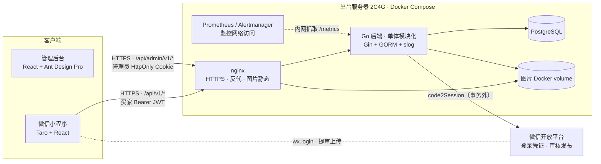
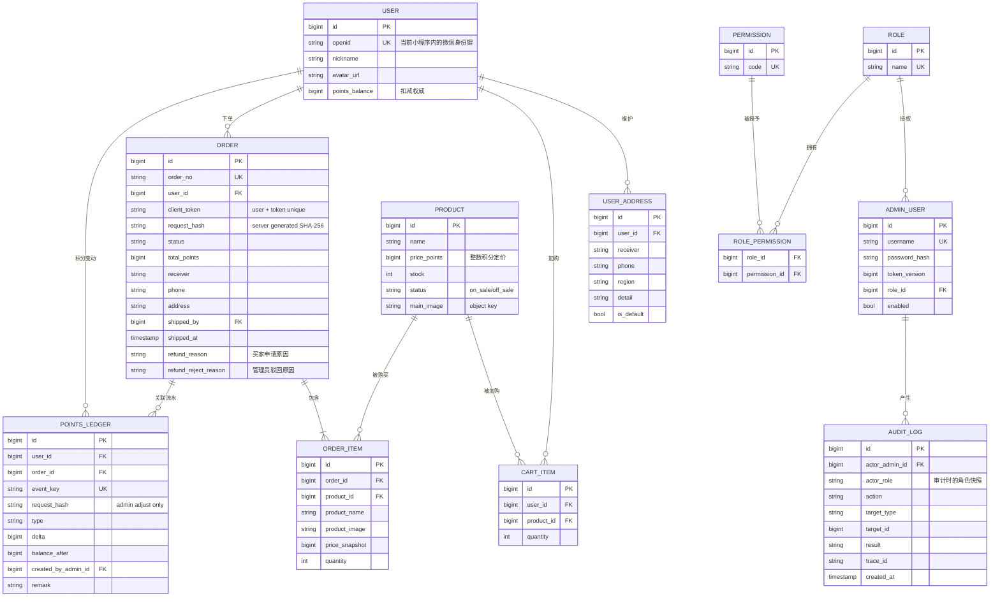
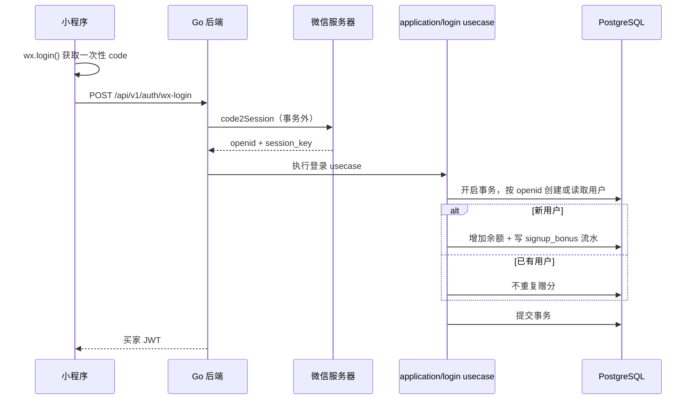
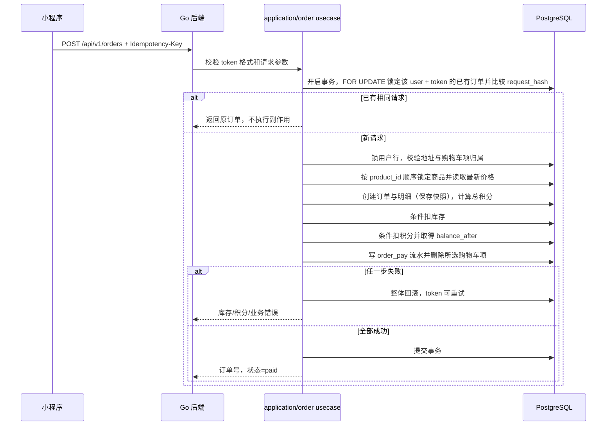
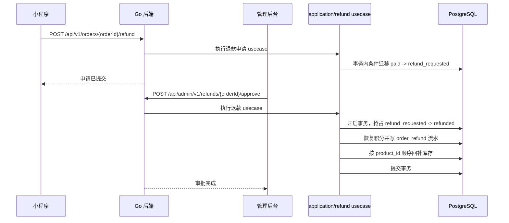
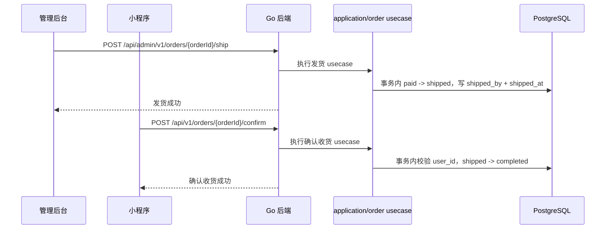
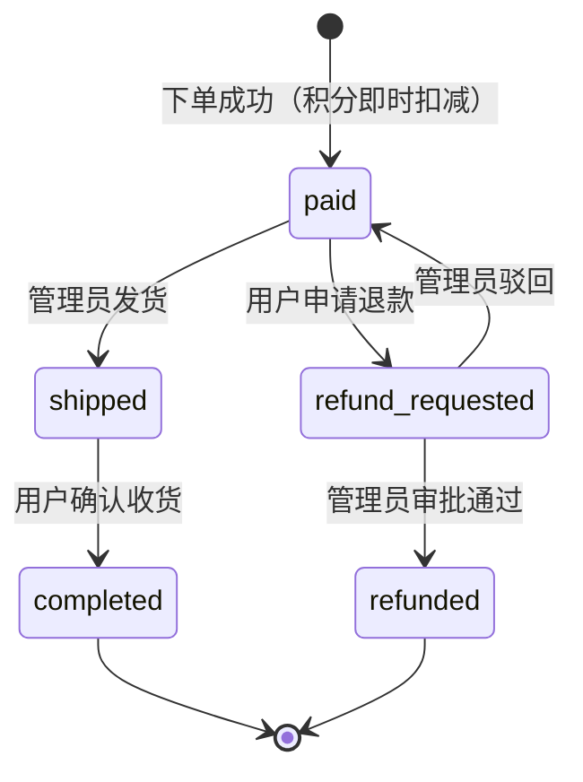

# 电商小程序 · 架构总览

本文档是整个项目的架构入口。接口字段、错误码和鉴权细节以 `../api/openapi.yaml` 为唯一契约源；端内实现看 01~04，数据库落库细节看 `05-database.md`。

## 1. 系统拓扑



- 单体单服务。课程体量上微服务只有成本没有收益；模块边界切清楚，以后要拆才拆得动。
- 管理后台和小程序复用同一个后端服务，靠接口分组、独立鉴权和权限码隔离。
- `/health/live` 只判断进程存活，`/health/ready` 检查数据库等关键依赖；两个探活接口不使用业务 JWT，但只允许探活网络访问。
- 图片文件存储在独立 Docker volume，数据库只保存稳定 object key，不保存完整域名。

## 2. 技术选型与关键决策

| 决策 | 选择 | 理由 |
|---|---|---|
| 后端栈 | Go + Gin + GORM，迁移用 goose | 编译成单二进制，镜像小，生态成熟 |
| 事务编排 | `internal/application` usecase | 跨模块事务只有一个提交点，避免部分提交 |
| 后端日志 | slog | 标准库结构化日志，统一 trace_id |
| 后端监控 | prometheus/client_golang | 暴露 `/metrics`，由监控网络抓取 |
| 小程序端 | Taro + React | 与管理后台复用 React 经验 |
| 小程序状态 | Zustand | 只管理轻量客户端状态 |
| 管理后台 | React + Ant Design Pro | 列表、表单、权限组件成熟 |
| 数据库 | PostgreSQL，唯一数据库 | 各环境使用同一 Docker 镜像，减少差异 |
| 支付 | 积分代替真实支付 | 当前不接真实支付，但保留替换边界 |
| 图片存储 | 本地 volume + storage adapter | 当前简单可控，后续可替换对象存储 |
| 部署 | 单台 2C4G + Docker Compose | 详见第 8 节 |

## 3. 端间契约

完整接口、请求响应字段、security scheme 和权限扩展维护在 `docs/api/openapi.yaml`。

### 3.1 统一响应

```json
{
  "code": 0,
  "data": {},
  "message": "ok",
  "trace_id": "01J..."
}
```

- `code=0` 表示成功，非 0 为稳定业务错误码。
- `trace_id` 同时通过响应体和 `X-Trace-Id` 响应头返回。
- 内部异常不把 SQL、堆栈、微信密钥和敏感个人信息返回客户端。
- HTTP 状态码表达认证、权限、资源和冲突语义，具体映射以 OpenAPI 为准。
- 业务 API 使用统一响应包裹；`/health/live`、`/health/ready` 和 `/metrics` 是运维接口例外，响应格式由 OpenAPI 单独定义，并通过网络访问控制保护。

### 3.2 鉴权矩阵

| 范围 | 路径 | 鉴权 |
|---|---|---|
| 买家登录 | `POST /api/v1/auth/wx-login` | 公开 |
| 商品浏览 | `GET /api/v1/products`、`GET /api/v1/products/{id}` | 公开 |
| 买家业务 | `/api/v1/me`、`/cart`、`/addresses`、`/orders`、`/points` | 买家 Bearer JWT |
| 管理员登录 | `POST /api/admin/v1/auth/login` | 公开 |
| 管理员业务 | 其他 `/api/admin/v1/*` | 管理员 Cookie JWT + 权限码 |
| 探活监控 | `/health/*`、`/metrics` | 网络访问控制，不使用业务 JWT |
| 静态图片 | `/static/images/*` | 公开只读 |

- 未列入公开清单的接口默认拒绝访问。
- 买家 JWT 只代表身份，不代表资源归属；订单、地址、购物车和流水必须在 service 层追加 `user_id` 条件。
- 买家访问其他用户资源返回 404，避免泄露资源是否存在；管理员权限不足返回 403。
- 管理员 Cookie 使用 HttpOnly、Secure、SameSite；写请求必须通过 CSRF 校验。

### 3.3 错误码和通用约定

| 段 | 范围 | 示例 |
|---|---|---|
| 通用 | 1000-1999 | 参数、认证、权限、资源不存在 |
| 认证 | 2000-2999 | code2Session 失败、登录态过期 |
| 商品 | 3000-3999 | 商品下架、库存不足 |
| 订单 | 4000-4999 | 幂等冲突、状态迁移非法 |
| 积分 | 5000-5999 | 余额不足 |

- 分页：`page` 从 1 起，`page_size` 默认 20、上限 100；响应包含 `list`、`total`、`page`、`page_size`。
- 时间：ISO 8601 UTC，Go 使用 RFC3339。
- 商品列表按 `id DESC` 排序，配合 `(status, id)` 索引。
- 积分、价格、库存和数量全部使用整数。
- 下单使用 `Idempotency-Key` header；成功重放返回原订单和 HTTP 200，参数变化返回 HTTP 409。

## 4. 数据模型

总览级 ER 只定实体、关键字段和关系，建表细节以 `05-database.md` 为准。



- `users.points_balance` 管实时扣减，`points_ledger` 管审计；余额和流水同一事务双写。
- 订单保存商品价格、商品信息和收货地址快照，商品改价、改图和地址修改不影响历史订单。
- `client_token` 与 `request_hash` 只记录成功订单；失败事务整体回滚。
- `event_key` 和业务级唯一索引防止重复账务事件。

## 5. 关键时序

### 5.1 登录与首次赠分



`session_key` 不落库、不下发、不写日志。事务提交失败时不签发 JWT；客户端重新调用 `wx.login()` 获取新 code。

### 5.2 下单



相同 token 的并发首建请求由 `(user_id, client_token)` 唯一约束处理：撞约束的事务回滚后重读获胜订单，按 `request_hash` 答复重放或冲突；不能把其他唯一约束冲突误判成幂等重放。

### 5.3 退款



审批驳回只做 `refund_requested -> paid`，不改余额、不写退款流水、不回补库存。并发审批中只有成功抢占状态的请求可以执行副作用。

### 5.4 发货和确认收货



两个操作都使用条件状态更新，重复请求不重复写入时间或操作人。

## 6. 订单状态机



- 状态迁移必须在 service 层通过白名单校验，并在数据库更新语句中带原状态条件。
- 退款只允许从 `refund_requested` 审批；发货只允许从 `paid` 迁移。
- 不存在待支付、自动确认收货和物流单号状态。

## 7. 安全与隐私

- 买家 JWT 使用 Bearer；管理员 JWT 使用 HttpOnly Cookie，二者密钥、audience 和中间件完全分开。
- 管理员 JWT 包含 `sub`、`iss`、`aud`、`iat`、`exp`、`jti`、`kid`、`token_version`；权限不写入 token。
- 改密或禁用账号递增 `token_version`，旧 token 立即失效。
- 登录失败按账号和 IP 限速，错误信息不区分账号不存在和密码错误。
- 手机号、收货地址、微信 code、session_key、JWT 和密码不得写入普通业务日志。
- 管理员对商品、发货、退款、积分调整、改密和权限变更写审计日志。
- 图片只接受 JPEG、PNG、WebP，校验魔数和解码结果；数据库保存 object key，不保存完整 URL。

## 8. 部署形态与运行约定

```text
单台服务器 2C4G
└── Docker Compose
    ├── app        # Go 后端，多阶段构建
    ├── postgres   # 数据挂卷持久化
    └── nginx      # 反代、HTTPS、图片静态目录
监控组件（同一 compose 或独立监控主机）：prometheus / alertmanager
```

- 测试、生产数据库实例必须分开。
- 真实配置通过 Docker Secret 或等价密钥管理注入，`.env.example` 只保留字段清单。
- `PUBLIC_BASE_URL` 是受信任的 HTTPS 配置，不根据客户端 Host 生成 URL。
- 生产 migration 只做 forward migration；应用回滚不自动执行 `goose down`。
- 数据库、图片卷和配置都必须有加密离机备份。
- 目标恢复能力为 RPO <= 1 小时、RTO <= 4 小时，恢复演练记录进入 Runbook。
- 详细发布、备份和恢复步骤见 `../ops/release-recovery.md`。

### 8.1 配置字段

`.env.example` 只保留字段名和格式说明，真实值通过 Docker Secret 或部署系统注入：

```text
APP_ENV、HTTP_PORT、PUBLIC_BASE_URL、STATIC_DIR、LOG_LEVEL
DB_HOST、DB_PORT、DB_NAME、DB_USER、DB_PASSWORD、DB_SSLMODE
DB_MAX_OPEN_CONNS、DB_MAX_IDLE_CONNS、DB_CONN_MAX_LIFETIME
JWT_USER_KEYRING_FILE、JWT_ADMIN_KEYRING_FILE、JWT_USER_ACTIVE_KID、JWT_ADMIN_ACTIVE_KID
JWT_USER_TTL、JWT_ADMIN_TTL
WX_APPID、WX_SECRET、SIGNUP_BONUS_POINTS、UPLOAD_MAX_BYTES
ADMIN_INIT_USERNAME、ADMIN_INIT_PASSWORD（仅 bootstrap 使用）
```

生产启动时校验必需字段、密钥熵、URL scheme、积分配置和上传上限；缺少 Secret 或使用弱值时 fail closed。

## 9. 本期不做的边界

- 订阅消息：预留，不实现。
- 优惠券和营销活动：不做。
- 真实支付：接口形状预留，不接渠道。
- 图片对象存储：本期使用本地 volume，通过 storage adapter 预留替换点。
- 物流单号：不采集、不展示。
- 签到、任务等其他积分来源：不实现。
- 验证码、忘记密码和强制改密：不实现；管理员通过 bootstrap 和改密流程运维。
- 物流自动通知和自动确认收货：不实现。

边界外能力必须通过变更提案进入，不允许顺手加入主链路。
