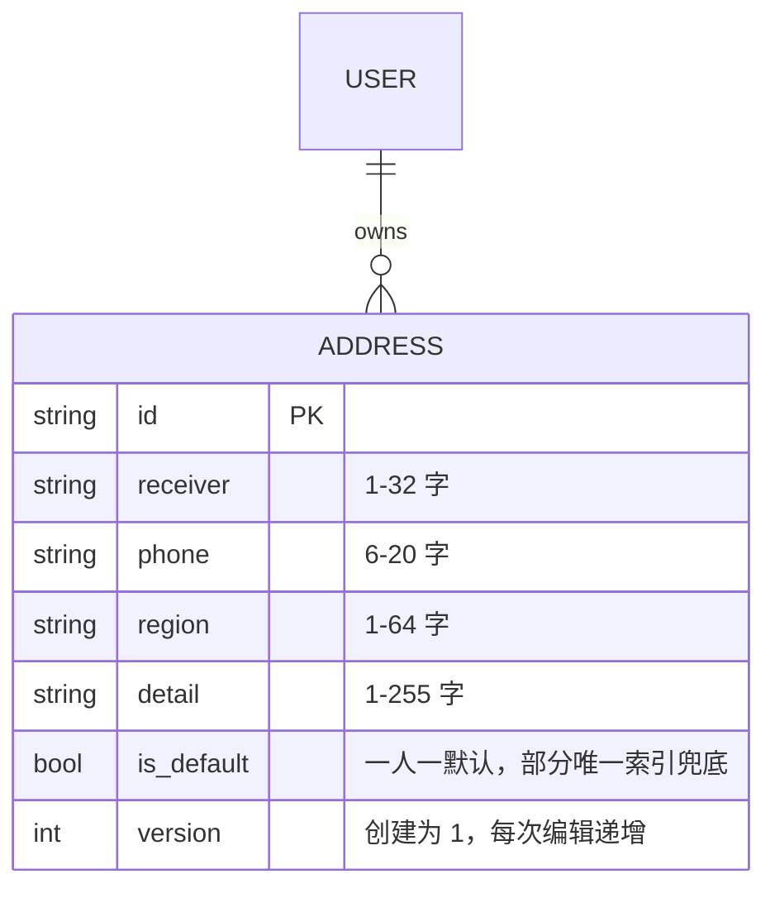
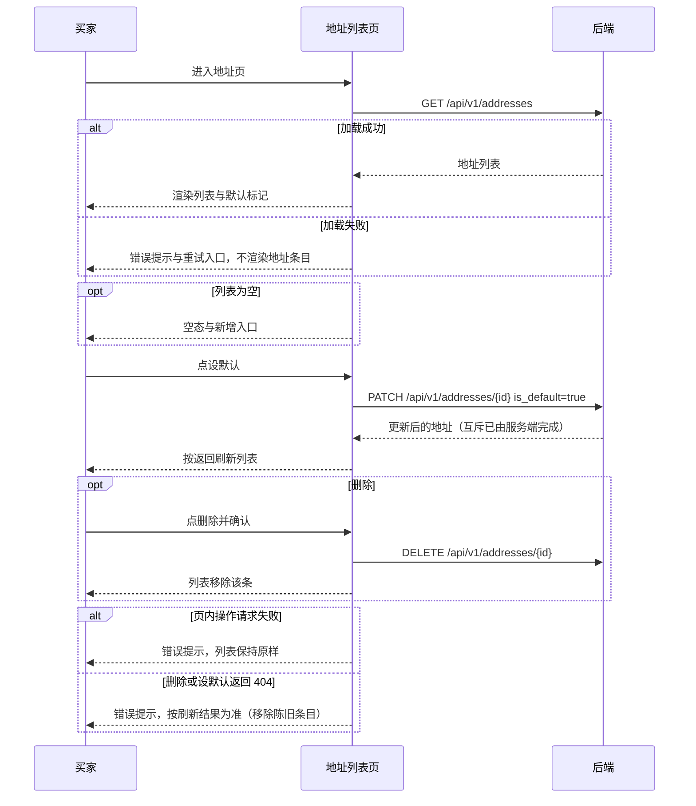
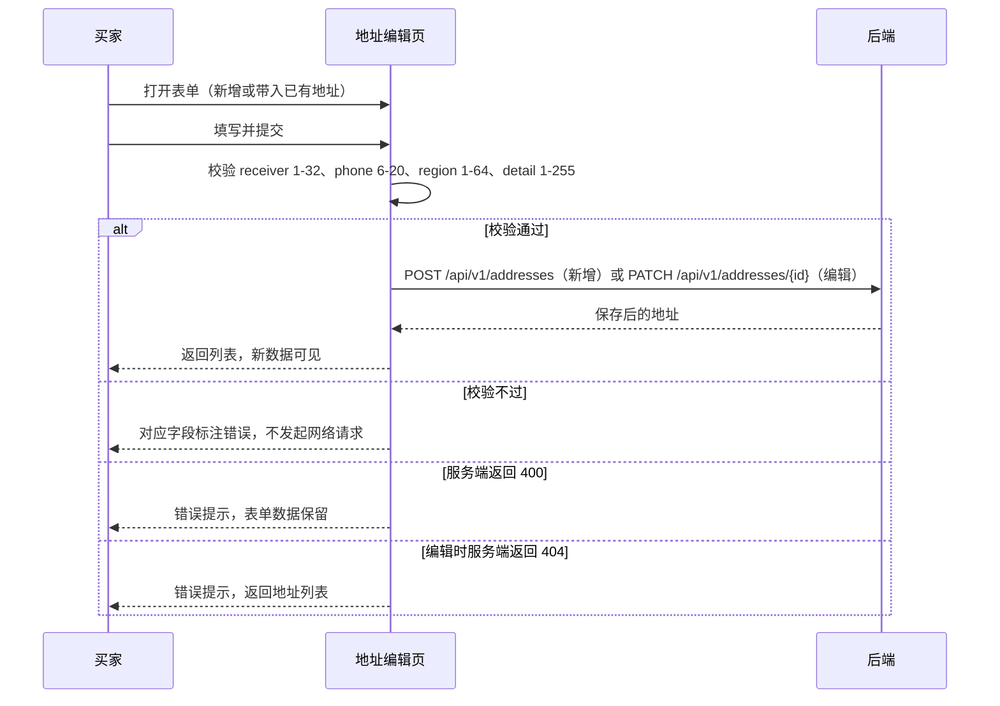

# Tech Spec：miniapp 收货地址管理

| 字段 | 值 |
|---|---|
| PRD 来源 | docs/prd.md |
| 关联 ticket | 无 |
| 负责服务 | miniapp |
| 状态 | 已评审 |
| 更新日期 | 2026-08-30 |

## 1. 背景与目标

checkout 的地址选择要求买家已持有地址（`canSubmitCheckout` 要求 address 非空），后端地址能力（增删改查、一人一默认）已交付，但小程序没有地址管理页面，买家无法创建地址，下单流程走不通。本功能补齐 miniapp 端的地址维护页面，让买家从「我的」完成地址的新增、编辑、删除、设默认，checkout 即被解锁。

成功标准：买家全程可用地址维护；页面逻辑抽进 controller.ts 并有 node:test 覆盖，`pnpm test` 通过。

范围限制：后端零改动；接口契约以 docs/api/openapi.yaml 为准；日志不得输出手机号全文（对齐 PRD 安全要求，地址列表页正常展示完整手机号）。产品决策：首个地址不自动设为默认（维持后端现有行为，is_default 不传即非默认），买家需要时主动设默认。

## 2. 功能需求

- 买家（小程序端）进入地址列表页，看到自己全部收货地址，默认地址带标记；无地址时展示空态和新增入口。
- 买家通过表单新增地址：收件人、手机号、地区、详细地址四项必填；可勾选设为默认。
- 买家编辑已有地址：可修改任意字段，可设为默认；编辑成功后列表刷新。
- 买家删除地址：需二次确认，删除后从列表消失。
- 买家将任一地址设为默认：服务端保证一人一默认，设默认后其余地址的默认标记被顶掉，列表以服务端返回为准。

校验规则与错误处理见 §3 和 §4，接口细节见 §5。

## 3. 数据模型

本功能不新增持久化状态，复用后端 `user_addresses` 表；miniapp 只持有接口返回的 `Address` 视图对象（类型来自 `services/types.ts`）和编辑页的表单草稿状态（页面局部 state，不进全局 store）。

字段全部来自既有数据：`Address` 对象由后端接口返回，表单提交字段（receiver、phone、region、detail、is_default）是用户输入，无新增字段、无迁移。写入语义全部为服务端已有的 insert（Create）与 partial update（Update），本功能不直接写库。

两个既定约束要遵守：一是一人一默认由后端部分唯一索引保证，客户端不做互斥逻辑，渲染以服务端返回为准；二是编辑会使 version 递增，checkout 指纹消费 version（见 `lib/checkout-session.ts`），地址页只透传，不修改 version。

## 4. 流程

无异步补偿或后台处理任务，全部为页面内同步交互。

主流程一：列表页操作（加载、设默认、删除）。

主流程二：新增与编辑提交。

## 5. 接口契约

接口定义不在此复制，唯一契约源是 `docs/api/openapi.yaml`。本功能消费以下已确认端点：

| 端点 | 用途 | 关键约束 |
|---|---|---|
| `GET /api/v1/addresses` | 当前买家地址列表 | 返回 list，含 id、version、is_default |
| `POST /api/v1/addresses` | 新增地址 | receiver/phone/region/detail 必填，is_default 可选 |
| `PATCH /api/v1/addresses/{addressId}` | 部分更新（编辑、设默认） | 只传变更是合法用法；id 归属校验，非本人返回 404 |
| `DELETE /api/v1/addresses/{addressId}` | 删除地址 | 无 body，删除不存在的或他人的地址返回 404 |

错误行为：字段非法返回 400（校验规则见 §3）；地址不存在或不属于当前买家一律 404，不区分两种情况；未登录由 transport 层统一处理，本功能不重复处理。
