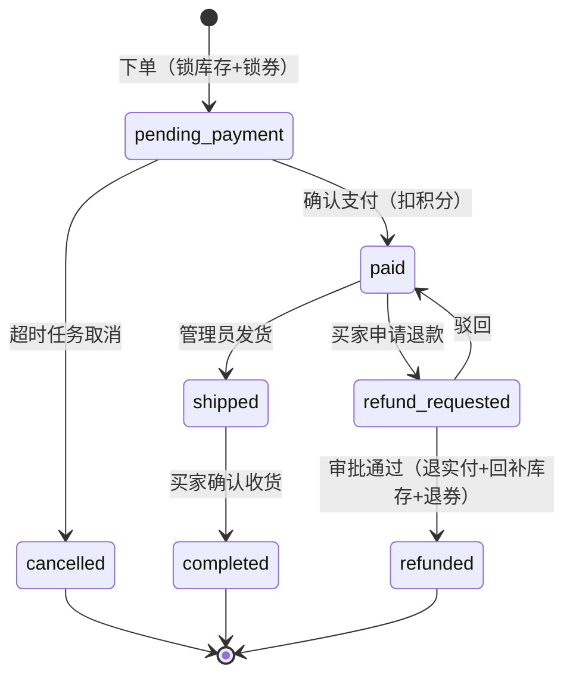
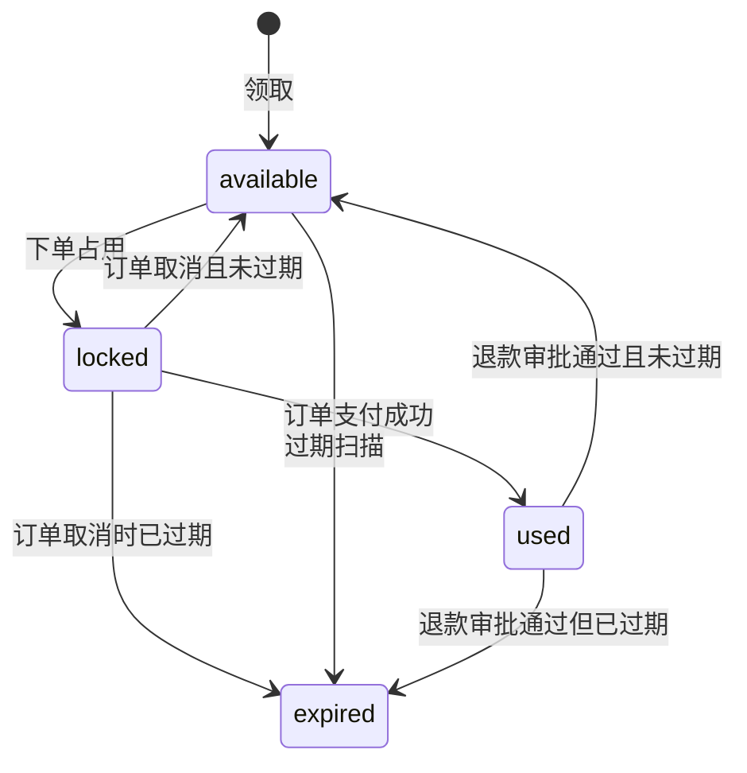
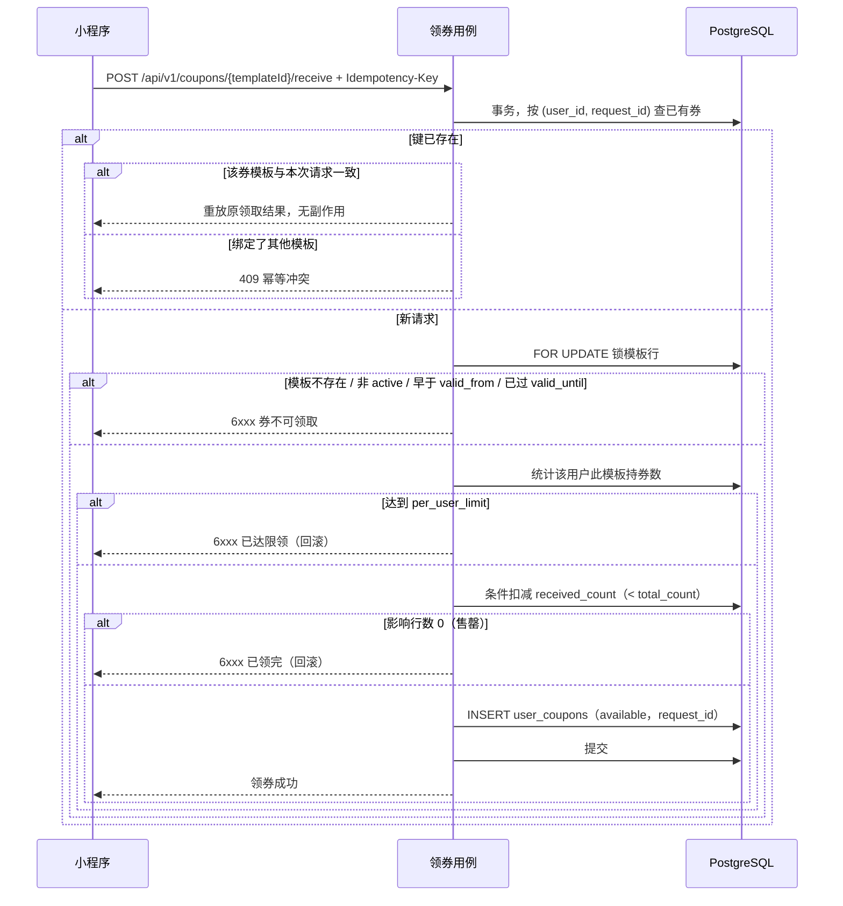
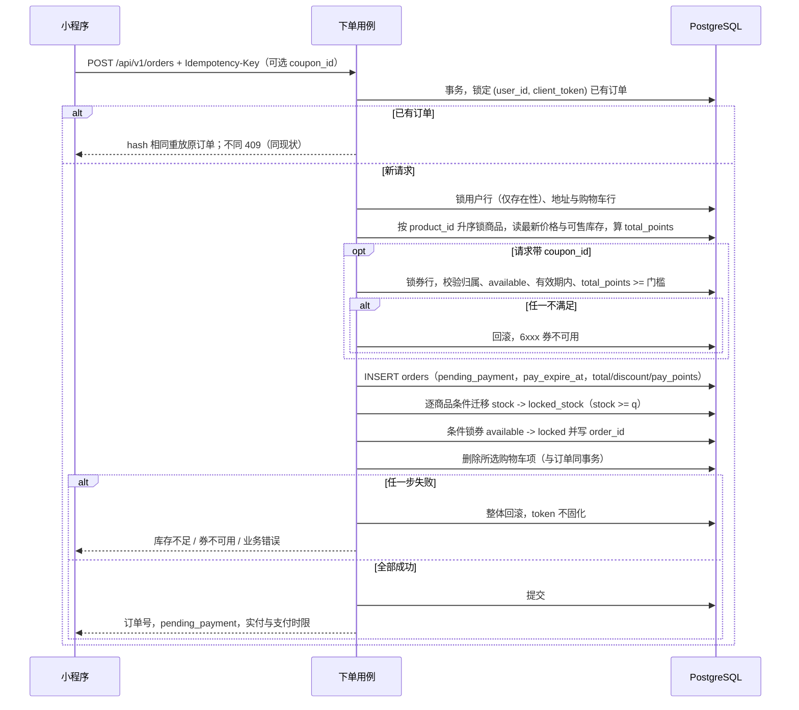
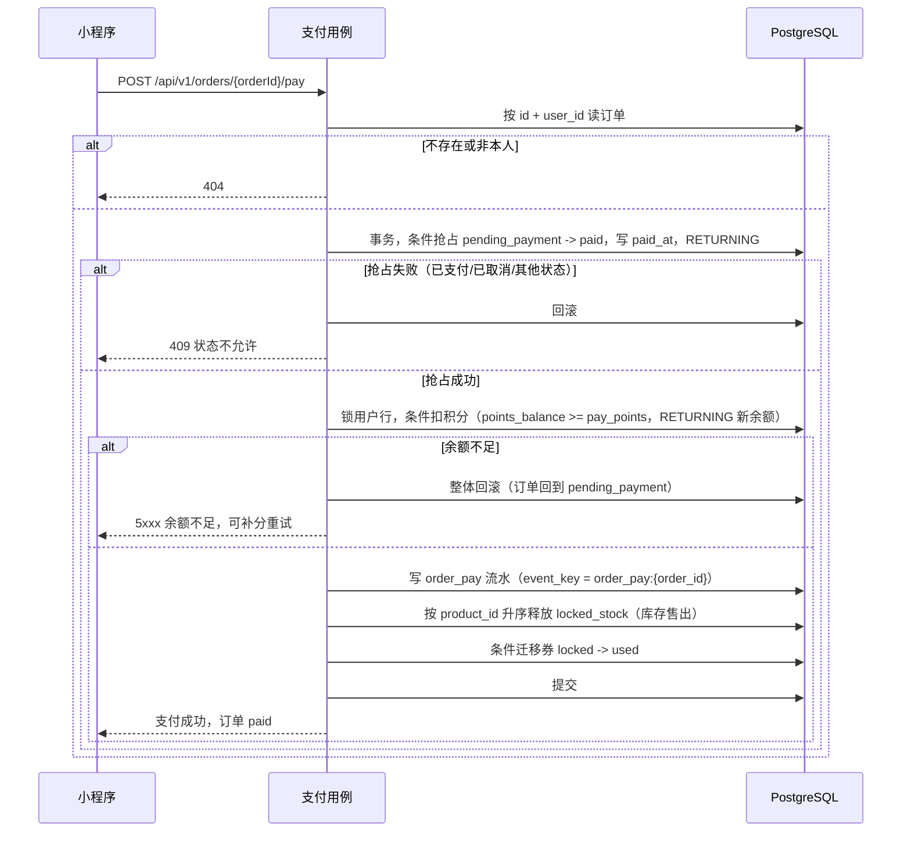
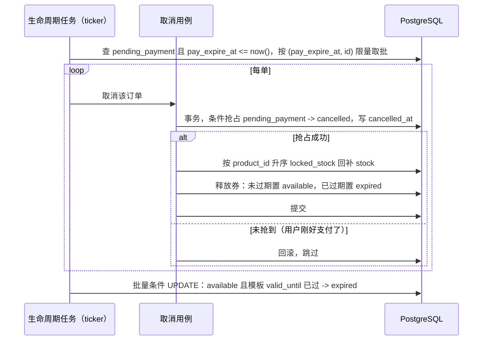

# Tech Spec：优惠券与订单支付生命周期

| 字段 | 值 |
|---|---|
| PRD 来源 | 无（用户确认的增补决策，覆盖 PRD 与主档"不做优惠券、不做待支付"两条边界） |
| 关联 ticket | 无 |
| 负责服务 | backend / miniapp / admin |
| 状态 | 草稿 |
| 更新日期 | 2026-09-03 |

## 1. 背景与目标

现状下单即支付：提交订单的同一事务里直接扣积分、生成已支付订单，商品是单一定价，没有任何营销能力。本功能把下单拆成"下单预占 → 确认支付"两个动作，新增满减券，并让超时未支付的订单由后台任务自动取消、释放占用的库存和券。

用户结果：买家能领券、用券，下单后有一段时间决定要不要付；超时不付订单自动作废，库存和券回到可卖、可领的状态。管理员能创建和停发券模板，能看已领取与已核销数量。

成功标准（本功能范围内）：下单-支付-超时取消全链路在并发下不超卖、不超发、不重复扣积分，订单、积分流水、券状态三者对得上；现有 e2e 与并发集成测试在新链路下全绿，并为每条新不变量补用例。

范围限制：

- **券**：只做一个券种——满减券（订单原价满 X 减 Y，X、Y 为积分数值），一单一张，不叠加、不找零；无折扣券、无定向发券、无券码兑换。
- **退款**：维持整单全额（按实付退），不做部分退款与优惠分摊。
- **模板**：创建后规则与有效期不可改，只能切换发放状态。
- **订单**：买家没有主动取消待支付订单的入口，只能支付或等超时。
- **支付**：不接真实支付，"支付"指确认扣积分。

以上边界外的能力必须经变更提案进入。

## 2. 功能需求

**买家（小程序）**

- 买家进入领券中心，看到处于有效期内且发放中的券模板，可以领取；超出模板总量或每人限领数时服务端拒绝，客户端不自行判额。网络重试导致的重复提交不会多领券（幂等语义见 §4 主流程 1）。
- 买家在结算页从自己的可用券中选一张（可不用券）；提交的券是否满足门槛、归属、状态、有效期，全部由服务端在下单事务内最终校验，不满足则整单失败、不产生任何副作用。
- 买家提交订单后得到一笔待支付订单：库存与券被预占，积分不变，购物车项照旧删除。
- 买家在支付时限内确认支付，服务端按实付积分扣减余额、记一条下单支付流水，订单转为已支付。余额不足时支付失败，订单保持待支付，可补积分后重试。时限已过但取消任务尚未处理到该订单时，支付仍可与取消竞速成功（§4）。
- 重复点击支付、网络重试都不会重复扣积分：同一订单只可能成功支付一次。
- 买家订单列表与详情展示状态、原价、券抵扣与实付金额；待支付订单展示支付时限。
- 超时未支付的订单被系统自动取消，占用的库存与券随之释放（处置口径见 §4）。
- 买家退款申请与确认收货的状态前提维持现状（仅已支付可退、仅已发货可确认）。

**管理员（管理后台）**

- 管理员创建券模板：名称、门槛、抵扣、发放总量、每人限领、有效期起止；创建即冻结，之后只能切换发放/停发。
- 管理员查看券模板列表，含已领取数量与已核销数量。
- 管理员审批退款通过时，退的是该订单实付积分，并回补库存、处置该订单占用的券（口径见 §4 主流程 5）。
- 券模板的创建与发放状态切换写入只追加审计日志，动作与商品变更同级。

**系统（后端任务与不变量）**

- 周期任务扫描已超过支付时限的待支付订单，逐单取消并释放库存与券；任务崩溃重启后从数据库现状续扫，同一订单重复处理不产生第二次副作用。
- 超过有效期仍未使用的券会被周期任务置为过期终态；被订单占用或已核销的券的过期处置口径以 §4 券状态机为唯一出处。
- 任何路径（下单、支付、取消、退款）都不得让库存可售数、预占数、券状态、积分余额出现负值或跳变；这些不变量由条件更新与数据库 CHECK 兜底，服务层校验只是快速失败。
- 支付与超时取消并发时只可能有一个成功，未成功的一方不产生任何账务或库存副作用（机制见 §4）。

## 3. 数据模型

新增两张表（营销域）：`coupon_templates`、`user_coupons`。变更四处：`orders`（状态、时间戳、金额字段）、`products`（库存拆列）、`permissions` 种子与 `role_permissions` 种子（新增两个权限码及授予关系）。积分流水 `points_ledger` 不变更列，仅 `order_pay` 事件的写入时机从下单移到支付确认。

主键与外键口径遵循全局决策 `./08-uuid-primary-keys.md`（全系统主键迁移 UUIDv7，服务层生成）：两张新表直接用 UUID 主键，`user_coupons.order_id` 引用迁移后的 `orders.id`，实现以 08 的迁移完成为前置。

### coupon_templates（insert；状态切换与发放计数为条件 UPDATE）

| 字段 | 类型 | 来源 | 约束 |
|---|---|---|---|
| `id` | UUID | 服务生成（UUIDv7） | PK |
| `name` | VARCHAR(64) | 管理员输入 | 非空 |
| `threshold_points` | BIGINT | 管理员输入 | `> 0`，订单原价达到该值可用 |
| `discount_points` | BIGINT | 管理员输入 | `> 0`；CHECK `discount_points < threshold_points` |
| `total_count` | INT | 管理员输入 | `> 0`，发放总量 |
| `per_user_limit` | INT | 管理员输入 | `> 0`，每人限领数 |
| `received_count` | INT | 服务维护 | 默认 0；CHECK `>= 0 AND <= total_count`（超发最后防线） |
| `valid_from` / `valid_until` | TIMESTAMPTZ | 管理员输入 | CHECK `valid_until > valid_from`；领取与使用均以此为准 |
| `status` | VARCHAR(16) | 管理员输入 | 枚举 `active`（发放中）\| `halted`（停发），默认 `active`；停发不影响已领券的使用 |

决策性约束：发放扣减写为 `UPDATE ... SET received_count = received_count + 1 WHERE id = ? AND received_count < total_count`，影响行数 0 即售罄。`discount_points < threshold_points` 保证凡是用券成交的订单实付必然大于 0（原价 ≥ 门槛 > 抵扣）。规则字段创建后不开放修改。

### user_coupons（insert 于领取；状态迁移为带原状态条件的 UPDATE）

| 字段 | 类型 | 来源 | 约束 |
|---|---|---|---|
| `id` | UUID | 服务生成（UUIDv7） | PK |
| `user_id` | UUID | JWT 派生 | 外键 `users`，级联删除 |
| `template_id` | UUID | 请求输入（领取时） | 外键 `coupon_templates`，RESTRICT |
| `status` | VARCHAR(16) | 服务迁移 | 枚举 `available` \| `locked` \| `used` \| `expired`，插入即 `available` |
| `order_id` | UUID | 服务写入（锁券时） | 外键 `orders`，可空；记录最近一次占用它的订单 |
| `request_id` | VARCHAR(64) | 客户端输入（领取时的 `Idempotency-Key`） | 可空（仅领取路径写入）；领取幂等键 |

决策性约束：

- 部分唯一索引 `ON (order_id) WHERE status IN ('locked','used')`：一张券同一时刻至多被一笔在途或已成交订单占用；取消释放后索引让位，同一券可再被新订单使用，历史 `order_id` 保留作留痕。
- 券本身不存规则快照，门槛与抵扣实时取自 `coupon_templates`；这成立的前提是模板规则创建后不可变（§1 范围限制）。
- 索引 `(user_id, status, id DESC)` 供我的券与结算页券列表。
- 每人限领：领取事务内锁模板行（`FOR UPDATE`），数出该用户此模板的持券数与 `per_user_limit` 比较，再走上面的条件扣减；行锁串行 + 扣减兜底，与商品防超卖同一套路。
- 领取幂等：部分唯一索引 `ON (user_id, request_id) WHERE request_id IS NOT NULL`，幂等域是单个买家；同一 `(user_id, request_id)` 重放原结果，同键绑定不同模板返回 409 冲突。换键即视为新领取。

### products 变更

新增 `locked_stock INT`（来源：服务维护；默认 0；CHECK `>= 0`）。`stock` 含义收窄为"可售、不含预占"，现有"下单即扣减"路径废弃。三处迁移语义：下单 `stock - q` 且 `locked_stock + q`（条件 `stock >= q`）；支付成功 `locked_stock - q`（库存售出）；超时取消 `locked_stock - q` 且 `stock + q`（回补）。存量数据无需换算（`locked_stock` 补 0 即可）。

### orders 变更

| 字段                | 类型          | 来源   | 约束                                                                                                              |
| ----------------- | ----------- | ---- | --------------------------------------------------------------------------------------------------------------- |
| `status`          | VARCHAR(20) | 服务迁移 | 枚举扩为 `pending_payment` \| `paid` \| `shipped` \| `completed` \| `refund_requested` \| `refunded` \| `cancelled` |
| `pay_expire_at`   | TIMESTAMPTZ | 服务生成 | NOT NULL；创建时刻 + 配置项 `ORDER_PAY_TIMEOUT_MINUTES`（默认 15）；存量已支付订单迁移回填为 `paid_at`（终态不会被扫描，取值不影响行为）                  |
| `discount_points` | BIGINT      | 服务派生 | 默认 0；CHECK `>= 0`；未用券恒为 0                                                                                       |
| `pay_points`      | BIGINT      | 服务派生 | CHECK `pay_points = total_points - discount_points AND pay_points > 0`；支付与退款金额的唯一口径                             |
| `cancelled_at`    | TIMESTAMPTZ | 服务生成 | 可空                                                                                                              |
| `paid_at`         | TIMESTAMPTZ | 服务生成 | 从"默认 now"改为待支付→已支付迁移时写入；列改为可空                                                                                   |

不变的部分：`total_points` 仍是明细快照价合计（原价口径）；`(user_id, client_token)` 幂等、地址与商品快照、既有五个状态间的一致性 CHECK 全部保留。

决策性约束（新增与扩展）：

- 状态-时间戳 CHECK 覆盖 7 个状态：`pending_payment` 与 `cancelled` 要求 `paid_at`、`shipped_by/at`、`completed_at`、`refunded_at` 全空；`cancelled ↔ cancelled_at`；`paid` 及其后续状态要求 `paid_at` 非空。
- `request_hash` 的规范化输入集合加入下单请求的 `coupon_id`，其编码沿用主档"规范化编码发布前冻结"条款。
- 新增部分索引 `ON (pay_expire_at, id) WHERE status = 'pending_payment'`，供超时扫描。
- 写入语义：下单 INSERT 即为 `pending_payment`；所有状态迁移一律带原状态条件的 UPDATE。

### 权限与审计

`permissions` 种子新增 `coupon:read`、`coupon:write` 两个权限码（来源：用户确认的目标设计；经 goose 增量迁移 insert，种子行主键取 `08` 口径的固定 UUID 字面量），超管与运营角色均授予；券模板列表归 `coupon:read`，创建与停发归 `coupon:write`。审计动作新增：券模板创建、券模板发放状态切换，复用 `audit_logs` 现有结构。

### ER 概览

```mermaid
erDiagram
    COUPON_TEMPLATE ||--o{ USER_COUPON : "发放"
    USER ||--o{ USER_COUPON : "领取"
    ORDER |o--o{ USER_COUPON : "在途或已成交订单占用"
    USER ||--o{ ORDER : "下单"
    COUPON_TEMPLATE {
        uuid id PK
        bigint threshold_points "满X可用"
        bigint discount_points "减Y；CHECK discount < threshold"
        int total_count "发放总量"
        int received_count "CHECK <= total_count"
        int per_user_limit "每人限领"
        timestamptz valid_until
        string status "active | halted"
    }
    USER_COUPON {
        uuid id PK
        uuid user_id FK
        uuid template_id FK
        string status "available | locked | used | expired"
        uuid order_id "可空留痕；locked|used 时部分唯一"
    }
    ORDER {
        uuid id PK
        string status "7 值枚举，见正文"
        timestamptz pay_expire_at
        bigint discount_points
        bigint pay_points "实付=原价-抵扣"
        timestamptz cancelled_at
    }
    PRODUCT {
        int stock "可售，不含预占"
        int locked_stock "预占"
    }
```

## 4. 流程

### 全局规则（对 `../tech-specs/flows.md` 的增量）

- 锁顺序扩展：下单事务为 订单行（幂等前置检查）→ 用户行 → 地址与购物车行 → 商品行按 `product_id` 升序 → 券行（最多一张）；支付事务为 订单行 → 用户行 → 商品行升序 → 券行；超时取消事务为 订单行 → 商品行升序 → 券行（不涉及用户行，因为不动积分）。
- 条件更新兜底、死锁 `40P01`/`40001` 整事务重试、外部调用在事务外——沿用现有全局规则。
- 新增一个周期任务循环（与图片清理循环同一装配模式）：`LIFECYCLE_SCAN_INTERVAL_SECONDS`（默认 30）一轮，先扫超时待支付订单再扫过期可用券；两阶段都按数据库当前状态判定、条件更新执行，天然支持漏扫续扫与坏数据重处理，无独立补偿表。
- 历史数据：goose 增量迁移扩 CHECK 枚举、加列，存量订单回填 `discount_points = 0`、`pay_points = total_points`、`pay_expire_at = paid_at`。

### 订单状态机（新）

### 券状态机（新）

`expired` 对可用券是终态；`used` 的券在退款时按"是否仍在有效期"回到 `available` 或 `expired`。

### 主流程 1：领取优惠券

同键两个首次请求并发时都能通过前置检查，后到者的 INSERT 撞 `(user_id, request_id)` 部分唯一索引整体回滚，事务外重读获胜券重放答复——与下单幂等同构。客户端更换键即视为新领取，消耗限领数与模板总量。

### 主流程 2：下单（预占，幂等）

支付与下单不同事务，积分余额在下单阶段完全不参与，因此下单不再做余额校验；余额只在支付确认时校验。

### 主流程 3：确认支付

订单已 `paid` 后再次调用支付返回 409，客户端刷新订单即可看到正确状态；`order_pay:{order_id}` 部分唯一索引保证即使代码路径出错也不可能出现第二条支付流水。支付请求与超时任务同时到达时，同一个条件 UPDATE 决出唯一赢家，输家零副作用。

### 主流程 4：超时取消与过期扫描

单个订单处理失败只记日志跳过，下一轮按同样条件再次命中（漏块续扫）；任务无内存状态，重启即恢复。取消不回补购物车（用户确认的既定决策）。

### 主流程 5：退款审批通过（对现有流程的变更）

现有抢占-回补结构不变，变更两点：退回积分的金额从 `total_points` 改为 `pay_points`；同一事务内把该订单占用的券从 `locked`/`used` 按有效期置回 `available` 或 `expired`（正常情况下审批时券必为 `used`）。驳回仍然零副作用，券保持 `used`。发货与确认收货流程不变。

## 5. 接口契约

统一响应包裹、分页、鉴权、越权 404 与 CSRF 约定沿用主档（`../tech-specs/interfaces.md`），此处只列新增端点与语义变更；字段级契约冻结进 `../api/openapi.yaml` 后重新生成两端类型。

错误码新增券段 **6000-6999**（语义类：券不可领取、已达限领、已领完、券不可用/不满足门槛）；支付复用积分段 5xxx（余额不足）与订单段 4xxx（状态迁移非法）。

### 买家域（`/api/v1`，买家 Bearer JWT）

- `GET /coupons/center` — 领券中心：处于有效期内（`valid_from` 已过、`valid_until` 未到）且 `active` 的模板列表，附当前用户已领数与可领标记；分页。
- `POST /coupons/{templateId}/receive` — 领取一张券，Header `Idempotency-Key`（UUID，落库为 `user_coupons.request_id`）；同键同模板重放原结果、同键异模板 409；其余错误归 6xxx（图见 §4 主流程 1）。
- `GET /me/coupons` — 我的券，`status` 查询参数四选一；响应含券名、门槛、抵扣、`valid_until`、状态、占用订单号（`locked`/`used` 时）。
- `POST /orders` — 请求体新增可选 `coupon_id`；成功响应为 `pending_payment` 订单，含 `total_points`、`discount_points`、`pay_points`、`pay_expire_at`。`coupon_id` 进入 `request_hash` 输入（§3）。
- `POST /orders/{orderId}/pay` — 确认支付（幂等语义见 §4 主流程 3）；不需要 `Idempotency-Key`，幂等域是订单本身。
- `GET /orders`、`GET /orders/{orderId}` — 列表与详情视图扩字段：新状态、原价/抵扣/实付、支付时限、券名；`cancelled` 订单可见。

### 管理员域（`/api/admin/v1`，Cookie JWT + 权限码 + CSRF）

- `GET /coupon-templates` — 模板列表，权限 `coupon:read`；含 `received_count` 与核销数（按 `user_coupons.status = 'used'` 聚合派生）。
- `POST /coupon-templates` — 创建模板，权限 `coupon:write`；规则字段创建后不可改；写审计。
- `PATCH /coupon-templates/{templateId}` — 仅切换 `status`（`active` ↔ `halted`），权限 `coupon:write`；写审计。
- `GET /orders` — `status` 筛选枚举扩为 §3 的 7 值。
- `POST /refunds/{orderId}/approve` — 路径与权限不变；副作用按 §4 主流程 5 变更。

### 鉴权矩阵增量

| 权限码 | 超管 | 运营 |
|---|---:|---:|
| `coupon:read` | ✓ | ✓ |
| `coupon:write` | ✓ | ✓ |

### 配置项（环境变量）

- `ORDER_PAY_TIMEOUT_MINUTES` — 支付时限，默认 15。
- `LIFECYCLE_SCAN_INTERVAL_SECONDS` — 生命周期任务扫描周期，默认 30。
