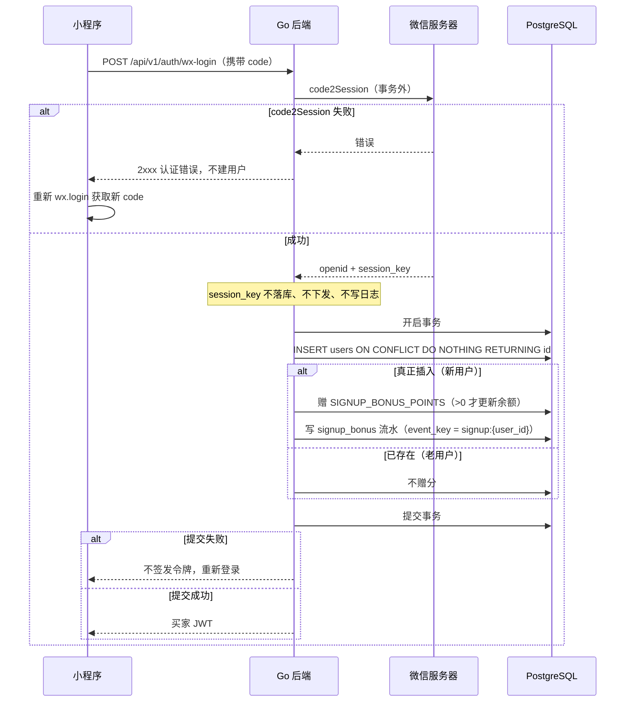
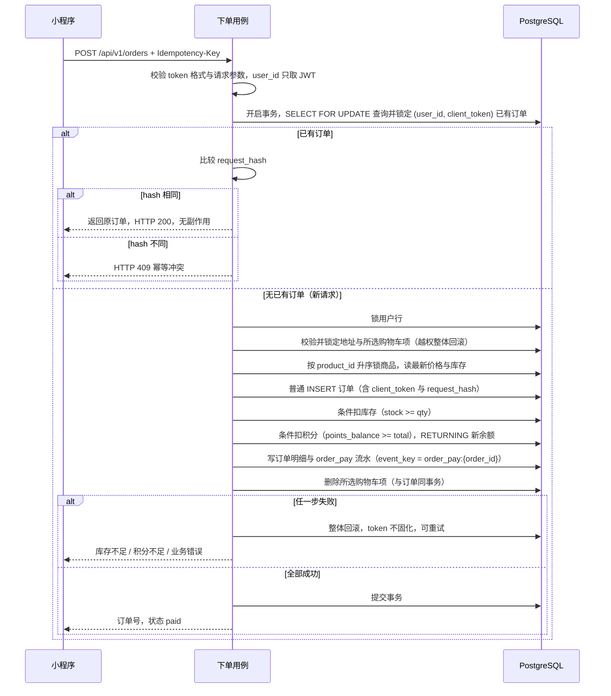
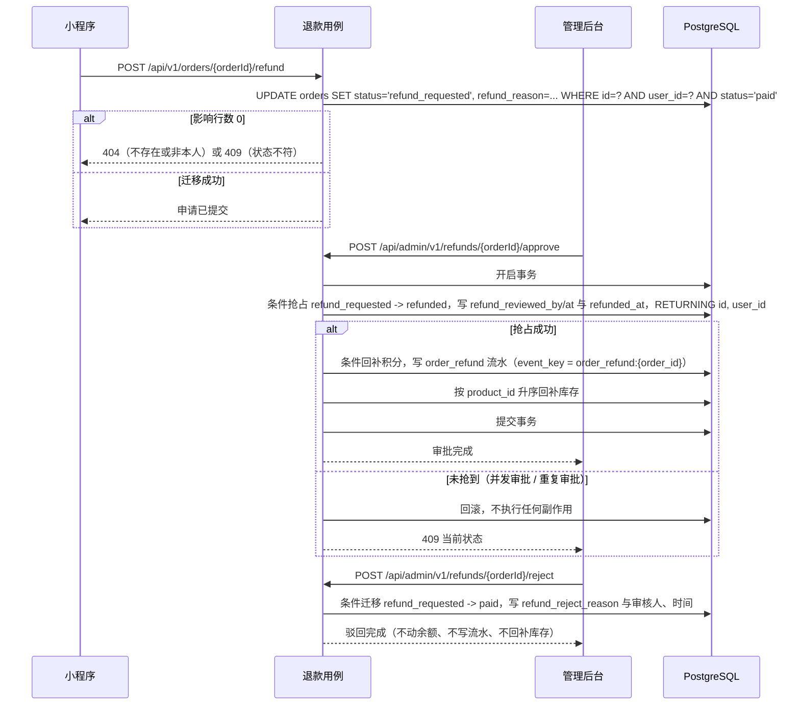
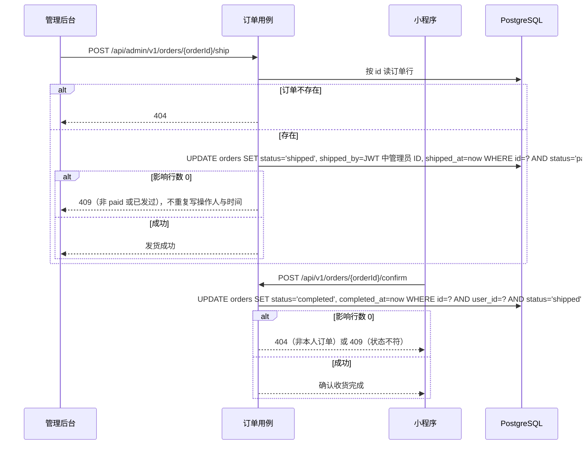
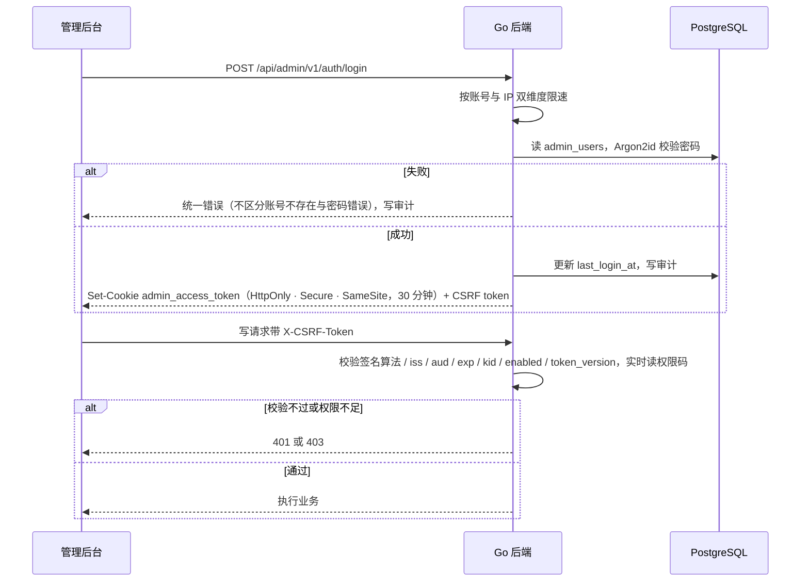
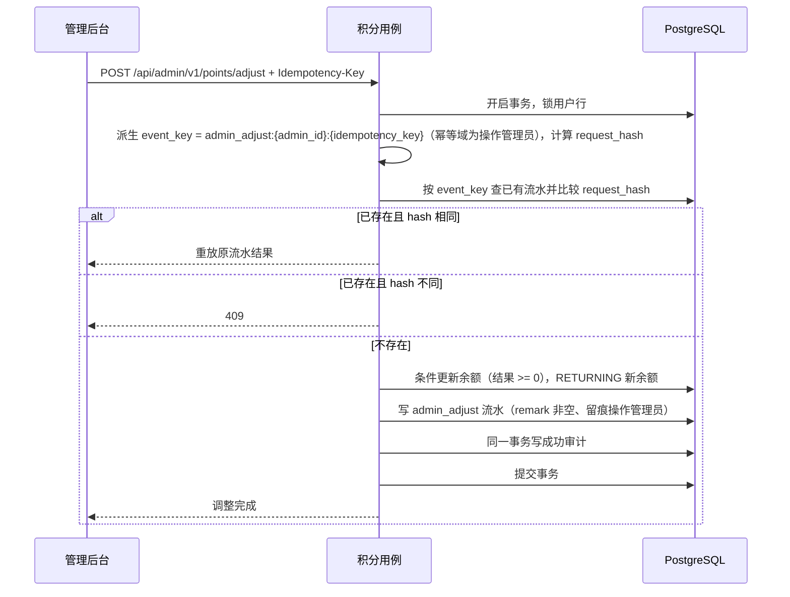

# 流程：shop-mall

本文件是全系统主流程的详情，入口与鸟瞰图见 [`shop-mall-tech-spec.md`](./shop-mall-tech-spec.md) 第 4 节。流程图与字段名以 [`data-model.md`](./data-model.md) 和 [`../api/openapi.yaml`](../api/openapi.yaml) 为准。

## 全局事务与并发规则

所有主流程共享同一套事务规则（依据 [`../architecture/02-backend.md`](../architecture/02-backend.md)）：

- **单一事务入口**：跨模块副作用由 `internal/application` 用例编排，`db.Transaction` 是唯一提交点；外部网络调用（微信 code2Session）必须在事务外完成，事务提交后才签发令牌或返回成功。
- **交易链锁顺序固定**：订单行（按 `(user_id, client_token)` 定位，下单时即前置重放检查）→ 用户行 → 地址与购物车行 → 商品行按 `product_id` 升序。
- **权限链锁顺序**：角色与管理员账号变更按 管理员行 → 角色行 → 权限映射，业务写与审计同一事务，同样按 `40P01`/`40001` 重试完整事务。
- **条件更新兜底**：库存扣减带 `stock >= qty`、余额扣减带 `points_balance >= amount` 并以 `RETURNING` 取新余额，影响行数为 0 即失败；状态迁移带原状态条件，重复请求不重复写副作用。
- **死锁重试**：仅在完整事务边界重试 PostgreSQL `40P01`（死锁）与 `40001`（序列化失败），重试是重新执行整个用例，不重试单条语句。
- **异步任务**：账务与订单链路无异步补偿任务；唯一的周期任务是未引用图片延迟清理（上传失败或替换图片留下的孤儿文件，按 `IMAGE_CLEANUP_INTERVAL` 周期执行）。历史数据处理仅发生在新增非空字段时，按 expand/backfill/contract 迁移。

## 1. 微信登录与首次赠分

触发：小程序调用 `wx.login()` 取得一次性 code（code 是一次性登录凭证，微信侧只能消费一次），请求 `POST /api/v1/auth/wx-login`。

- 赠分的新用户判定与"每用户至多一次"，由"只有真正插入用户的请求执行赠分" + `signup_bonus` 部分唯一索引共同保证。
- `SIGNUP_BONUS_POINTS=0` 时不更新余额、不写流水。
- code 在微信侧只能消费一次；网络超时不得盲目重放同一个 code，客户端重新 `wx.login()`。

## 2. 下单（幂等）

触发：买家在确认页提交，请求 `POST /api/v1/orders`，Header 携带客户端生成的 UUID 幂等键 `Idempotency-Key`（映射到 `orders.client_token`）。

- `request_hash` 输入为所选购物车项 ID、每项商品与数量、地址 ID 与地址 `version`（规范化后 SHA-256）；价格与库存不进 hash，由事务内实时读取。
- 同 token 两个首次请求并发时都能通过前置检查，后到者的 INSERT 撞 `(user_id, client_token)` 唯一约束、整体回滚，随后在事务外重读获胜订单，按 `request_hash` 答复 200 重放或 409 冲突。`order_no` 冲突单独处理，不得误判为幂等重放，其他唯一约束冲突也不得解释成重放。
- 客户端纪律：用户修改商品、数量或地址后必须换新 token；网络重试复用原 token。

## 3. 退款申请与审批

触发：买家对 paid 订单申请退款（`POST /api/v1/orders/{orderId}/refund`）；管理员审批（`POST /api/admin/v1/refunds/{orderId}/approve` 或 `/reject`，权限 `refund:approve`）。

审批通过的积分退回、流水写入、库存回补与状态抢占在同一事务；只有成功抢占状态的请求可执行副作用。退款金额由后端按订单快照计算，审批接口不接收金额。

## 4. 发货与确认收货

触发：管理员发货（`POST /api/admin/v1/orders/{orderId}/ship`，权限 `order:ship`）；买家确认收货（`POST /api/v1/orders/{orderId}/confirm`）。

`shipped_by` 只取管理员令牌，不信任请求体；本期不采集物流单号。

## 5. 管理员登录与鉴权

触发：后台提交用户名密码（`POST /api/admin/v1/auth/login`）。

令牌载荷含 `sub`、`iss`、`aud`、`iat`、`exp`、`jti`、`kid`、`token_version`，不含权限列表。改密或禁用递增 `token_version`，旧令牌下一次请求即失效。登录是 CSRF 例外（此时无 Cookie），靠 HTTPS、SameSite、Origin 校验与限流保护。

## 6. 管理员积分调整

触发：超管提交调整（`POST /api/admin/v1/points/adjust`，权限 `points:adjust`，携带 `Idempotency-Key`）。

- 流水、余额更新与成功审计在同一事务提交；被拒绝的请求（409、余额方向非法）在回滚后尽力补记失败审计，补记本身失败不改变对调用方的答复。
- 管理员不能直接修改余额字段；delta 可正可负，方向由余额条件更新兜底为非负。

