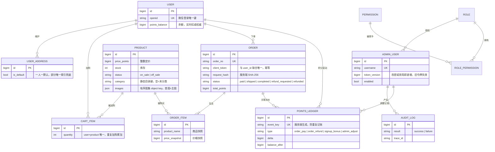
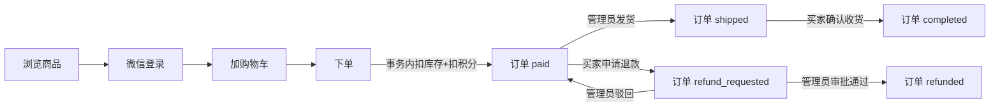

# Tech Spec：shop-mall 积分商城系统

| 字段 | 值 |
|---|---|
| PRD 来源 | docs/prd.md |
| 关联 ticket | 无 |
| 负责服务 | backend / miniapp / admin |
| 状态 | 草稿 |
| 更新日期 | 2026-08-31 |

> 本文件是 shop-mall 全系统的工程规格入口。完整表结构见 [`data-model.md`](./data-model.md)，各主流程时序见 [`flows.md`](./flows.md)，接口与鉴权细节见 [`interfaces.md`](./interfaces.md)。接口字段级唯一契约源为 [`../api/openapi.yaml`](../api/openapi.yaml)。

**谁说了算（裁决优先级）**：字段级接口契约 = `../api/openapi.yaml`；表结构真身 = `backend/migrations`（`../architecture/05-database.md` 是建表设计依据）；行为与流程 = 本文档集；端内界面与体验 = `../architecture/` 01/03；feature 级增补 = `../architecture/` 06 起的 feature techspec，与本文档集重叠的主题以 feature 份为准；部署、备份与恢复 = `../ops/`。本档与实现冲突时先裁决、后同步修改双方。

## 1. 背景与目标

shop-mall 是一个积分商城：买家在微信小程序用积分下单、确认收货、申请退款，运营管理员在后台上下架商品、发货、审批退款、调整积分。后端是 Go 单体，价格计算、库存扣减、积分账本、订单状态机和权限校验全部在服务端完成，两端前端只展示后端返回的结果。

用户结果：一个买家从登录、加购、下单到收货全程走通；一个管理员从登录、上商品、发货到审批退款全程走通。积分是唯一支付手段，所有积分变动记入只追加的流水，余额与流水在同一数据库事务内双写。

工程动机：把课程级电商链路做成一个可本地运行、可联调、可发布、可恢复的真实单体系统，模块边界切清，安全与一致性要求写进规格而非口头约定。

范围限制：本期不接真实支付（接口形状预留）、不做优惠券与营销、不采集物流单号、不做订阅消息与自动确认收货、不做验证码与忘记密码。边界外能力必须经变更提案进入，不顺手加入主链路。

## 2. 功能需求

**买家侧（小程序）**

- 买家未登录可浏览商品列表、分类和商品详情。
- 买家通过微信登录：小程序取一次性登录凭证 code，后端换取微信用户标识 openid 并签发买家令牌；首次登录自动赠送初始积分，赠送在用户生命周期内至多发生一次。
- 买家维护收货地址，可新增、编辑、删除，并可设默认地址；一人至多一个默认地址。
- 买家将商品加入购物车，同一商品的重复加购合并数量。
- 买家下单：选定地址与购物车项，提交时携带幂等键防止重复下单，服务端在同一事务内按最新价格扣减库存与积分并生成已支付订单。
- 买家查看自己的订单列表与详情，对已发货订单确认收货，对已支付订单申请退款。
- 买家查询自己的积分流水。

**管理员侧（管理后台）**

- 管理员以用户名密码登录，服务端以 HttpOnly Cookie 下发管理令牌并对写请求校验 CSRF。
- 管理员上架、下架、编辑商品并上传商品图。
- 管理员对已支付订单发货，操作人取自登录令牌而非请求体。
- 超级管理员审批退款申请，可通过或驳回；驳回仅回退状态，不产生积分与库存副作用。
- 超级管理员调整买家积分，调整携带幂等键并强制填写备注。
- 管理员管理角色与管理员账号：分配权限、禁用账号，不允许删除仍被引用的角色、不允许禁用最后一个超管、不通过接口删除管理员账号。
- 管理员改密须验证旧密码，改密或禁用账号后旧登录态立即失效；端点的权限要求见 §5 鉴权矩阵。

**积分与账务（系统）**

- 每笔积分变动即时落一条只追加流水，余额与流水必须在同一事务内变更；事件类型、方向与留痕约束的统一口径见 §3 账务域。
- 管理员不得直接改写余额字段，调整积分只能通过账务事件流水完成。
- 任何情况下系统不得自动改写余额或删除流水。

**鉴权与审计（系统）**

- 买家令牌只代表身份，不代表资源归属；订单、地址、购物车和流水查询一律在服务层校验对象归属，买家越权访问按资源不存在处理（状态码口径见 §5）。
- 管理端权限不写入令牌，每次请求按账号当前角色实时读取，权限修改下一次请求即生效；未列入公开清单的接口默认拒绝。
- 管理员对商品、发货、退款、积分调整、改密、禁用账号和权限变更写只追加审计日志，记录操作发生时的角色快照、动作、目标、结果、脱敏后的变更摘要与链路标识。
- 手机号、收货地址、微信 code、session_key、令牌与密码不得写入普通业务日志。

各端的界面与弱网交互行为见各端架构文档（`../architecture/01-miniapp.md`、`../architecture/03-admin.md`）；本规格只定义跨端职责边界与可验证行为，不复述端内实现。

## 3. 数据模型

系统持久化 12 张表：买家域 `users`、`user_addresses`、`cart_items`，商品域 `products`，交易域 `orders`、`order_items`，账务域 `points_ledger`、`audit_logs`，后台权限域 `admin_users`、`roles`、`permissions`、`role_permissions`。完整字段、类型、CHECK 约束、索引、写入语义与删除策略见 [`data-model.md`](./data-model.md)。

实体与关系概览：

关键决策性约束（详表与完整 CHECK 见 [`data-model.md`](./data-model.md)）：

- **整数原则**：积分、价格、库存、数量一律整数；余额与流水金额用 BIGINT。
- **快照原则**：订单保存商品名称、图片、价格与收货地址快照，商品改价改图或地址修改不影响历史订单。
- **双写一致**：`users.points_balance` 管实时扣减，`points_ledger` 管审计，二者同一事务双写；余额非负、流水 delta 非零、balance_after 非负由数据库 CHECK 兜底。
- **幂等与防重复记账**：`orders (user_id, client_token)` 唯一，`points_ledger.event_key` 唯一，另有 `signup_bonus / order_pay / order_refund` 三张部分唯一索引，防事件键生成错误时重复记账。
- **默认地址唯一**：`user_addresses` 上 `WHERE is_default = true` 的部分唯一索引保证一人至多一个默认地址。

## 4. 流程

系统主链路从买家浏览到订单终态（完成或退款）闭环，管理端的发货与退款审批嵌入订单生命周期。鸟瞰：

订单状态机：`[*] → paid → shipped → completed`，`paid → refund_requested → refunded`，`refund_requested → paid`（驳回）。状态迁移在服务层按白名单校验，并在数据库更新语句中带原状态条件；不存在待支付与自动确认收货状态。

各主流程从触发到可观察结果的详细时序、加锁顺序、幂等重放与失败回滚，见 [`flows.md`](./flows.md)，覆盖：微信登录与首次赠分、下单（幂等）、退款申请与审批、发货与确认收货、管理员登录鉴权、管理员积分调整。所有涉及积分、库存、订单的副作用都在单个数据库事务内完成，外部网络调用（微信 code2Session）在事务外执行。异步任务、周期任务与历史数据回填的口径以 [`flows.md`](./flows.md) 全局规则为唯一出处，此处不重述。

## 5. 接口契约

系统对外接口分买家域（`/api/v1/*`，Bearer 令牌鉴权）、管理员域（`/api/admin/v1/*`，HttpOnly Cookie 令牌 + 权限码）、运维域（`/health/*`、`/metrics`，网络访问控制，不走业务令牌）和公开静态（`/static/images/*`）。完整端点、鉴权矩阵、错误码段与逐端点请求响应约束见 [`interfaces.md`](./interfaces.md)；字段级定义以 [`../api/openapi.yaml`](../api/openapi.yaml) 为唯一契约源。

端点清单（方法以 openapi 为准，此处列路径与用途）：

**买家域**

- `POST /api/v1/auth/wx-login` — 微信登录换买家令牌（公开）
- `GET /api/v1/products`、`GET /api/v1/categories`、`GET /api/v1/products/{productId}` — 商品与分类浏览（公开）
- `GET/PATCH /api/v1/me`、`POST /api/v1/me/avatar` — 买家资料与头像
- `GET/POST /api/v1/cart`、`PATCH/DELETE /api/v1/cart/{itemId}` — 购物车
- `GET/POST /api/v1/addresses`、`PATCH/DELETE /api/v1/addresses/{addressId}` — 收货地址
- `POST /api/v1/orders`（幂等）、`GET /api/v1/orders`、`GET /api/v1/orders/{orderId}` — 下单与订单查询
- `POST /api/v1/orders/{orderId}/refund`、`POST /api/v1/orders/{orderId}/confirm` — 申请退款、确认收货
- `GET /api/v1/points/ledger` — 积分流水

**管理员域**

- `POST /api/admin/v1/auth/login`（公开）、`/logout`、`/password` — 登录、登出、改密
- `GET/POST /api/admin/v1/products`、`GET/PATCH /api/admin/v1/products/{productId}` — 商品管理
- `POST /api/admin/v1/images` — 图片上传
- `GET /api/admin/v1/orders`、`GET /api/admin/v1/orders/{orderId}`、`POST /api/admin/v1/orders/{orderId}/ship` — 订单查询与发货
- `GET /api/admin/v1/refunds`、`POST /api/admin/v1/refunds/{orderId}/approve`、`/reject` — 退款审批
- `POST /api/admin/v1/points/adjust`（幂等）— 积分调整
- `GET/POST /api/admin/v1/roles`、`PATCH /api/admin/v1/roles/{roleId}`、`GET /api/admin/v1/admin-users`、`PATCH /api/admin/v1/admin-users/{adminUserId}` — 角色与账号
- `GET /api/admin/v1/users`、`GET /api/admin/v1/audit-logs` — 买家列表、审计查询（各自独立权限码）

**运维域**

- `GET /health/live`、`GET /health/ready`、`GET /metrics` — 探活与监控，响应不走统一业务包裹。
